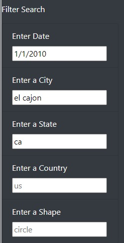
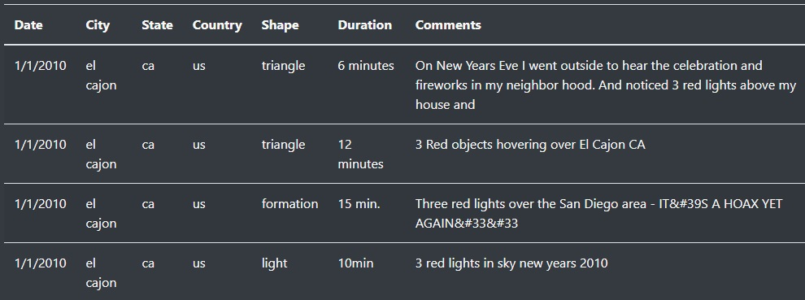

## Overview of Project: 
This project is designed to take data provided in the /static/js/data.js file and read it into an HTML table set. This is done using Javascript techniques by reading the data row by row and then creating a HTML table. This table is referenced inside the index.html file. The goal is to showcase the ability to read data and present it in a readable format for data consumption. 

## Results
With the completed code anyone can use the filters located on the bottom left of the page. In this example I entered in the following criteria for the following three boxes: 
Enter Date: “1/1/2010”
Enter a City: “el cajon”
Enter a State: “ca”

This returned 4 different results which matched the search criteria. 

## Summary: 
There are a few design improvements which could be made to this page using some additional Javascript functionality. 
* For the “Enter Date” field, if this was converted into a Calendar box or allow for someone to enter in a leading 0 into the date that the field would correct for this. Currently if someone enters in “01/01/2010” the page will not return any results. This is because the dataset has the information stored as “1/1/2010”
* For the remaining fields an additional improvement if the data was converted to “lower case” regardless of what the user typed in would also prevent case mismatch issues. 
* A button or method to clear all the data entered inside the section “Filter Search”. Each time the data must be cleared out of the respective search box. An improvement would be to add a button at the top of the section to “Clear All”.
* Another improve that could be implemented would be to add sorting options for each column. This would allow any column to sort the raw data or sort a filtered set of information. 
